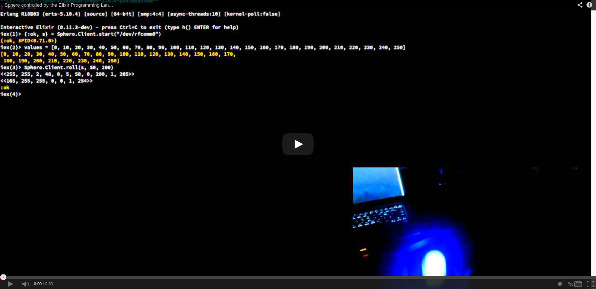

# Sphero

An Elixir library for interacting with a Sphero device that's connected via bluetooth.  Brought to you by Josh Adams, purveyor of [Elixir Sips](http://elixirsips.com).

[](http://www.youtube.com/watch?v=nwHjJgBTsV8)

## Usage

```elixir
{:ok, s} = Sphero.Client.start(device)
Sphero.Client.ping(s) #=> Sends an 0x01 0x00
```

Or to see an example:

```sh
mix run examples/square.exs
```

## Development

To get some sockets to play with without worrying about the sphero, use socat:

```sh
socat -d -d pty,raw,echo=0,nonblock=1 pty,raw,echo=0,nonblock=1
```

Then connect to one of those sockets in screen with:

```sh
screen /dev/pts/7 115200,8,N,1
```

And open the other with the sphero client.  Send it commands.  See them come
through...

## Debugging

To see what's being written to a given socket, you can do the following with
socat:

```sh
socat -d -d -u pty,raw,echo=0,nonblock=1 OPEN:/tmp/foo.data,create,append    
```

Now any bytes written into that socket will end up in the new file.

## TODO

I don't yet parse any of the messages coming FROM the sphero, but that's not
relevant to my Erlang Factory 2014 talk, so it won't come for a bit :)  Pull
Requests welcome :)
